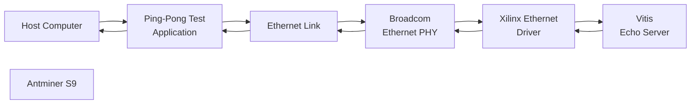
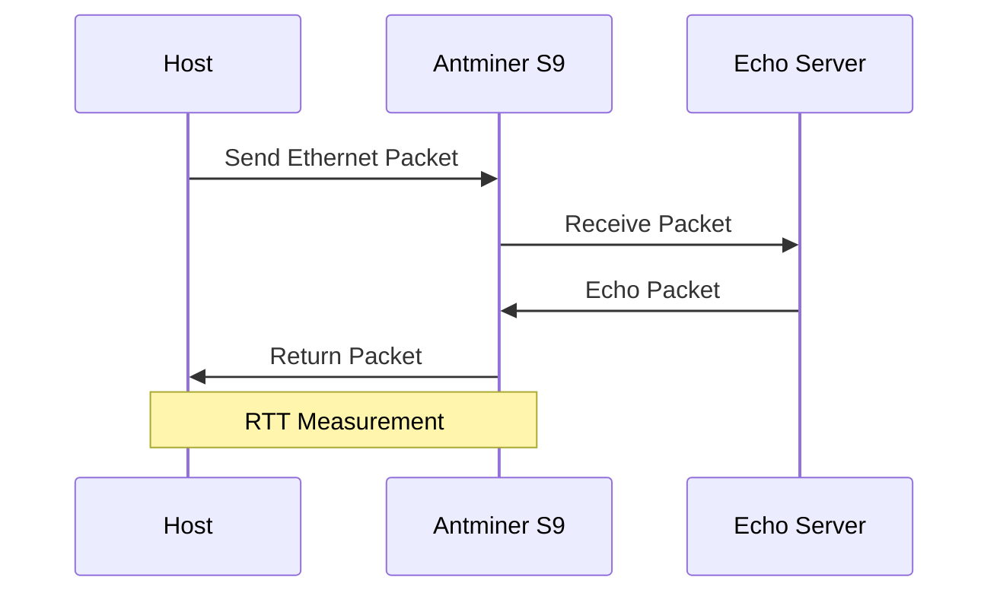

<div align="center">


</div>

---

# Antminer S9 Ethernet Communication with Broadcom PHY Support

This project extends the Xilinx Ethernet PHY library with **Broadcom PHY support** for the **Antminer S9** board and provides a complete Vivado/Vitis-based Ethernet communication system with ping-pong performance evaluation.

<div align="left">

[](https://www.xilinx.com/products/design-tools/vivado.html)
[](https://www.xilinx.com/products/design-tools/vitis.html)
[](https://en.wikipedia.org/wiki/Ethernet)
[](https://www.broadcom.com/)
[](https://shop.bitmain.com/)
[](#ping-pong-communication-test)
[](LICENSE)

</div>

## Abstract

The Ethernet PHY devices supported by the Xilinx Ethernet libraries do not include the **Broadcom PHY used by the Antminer S9**.

This project addresses this limitation by extending the Xilinx Ethernet PHY library and adding dedicated support for the Broadcom device.

The modified driver includes Broadcom PHY identification, model detection, and Ethernet speed detection while preserving the existing PHY support provided by the Xilinx library.

A complete hardware/software communication system was developed using **Xilinx Vivado and Vitis**. The software implementation is based on the standard **Echo Server** example provided by Vitis.

To evaluate the communication performance, a **ping-pong benchmark** was developed on the host system. Two test implementations are provided: a baseline implementation and an optimized implementation that applies warm-up iterations, thread-priority control, timer-resolution configuration, and high-resolution timing.

The system was evaluated using **20,000 communication samples** on three different host configurations. The results demonstrate significant improvements in RTT stability and effective bandwidth after applying the optimization techniques.

---

## Table of Contents

1. [Overview](#overview)
2. [Objectives](#objectives)
3. [System Architecture](#system-architecture)
4. [Broadcom PHY Support](#broadcom-phy-support)
5. [Vivado Hardware Design](#vivado-hardware-design)
6. [Vitis Echo Server](#vitis-echo-server)
7. [Ping-Pong Communication Test](#ping-pong-communication-test)
8. [Performance Optimization](#performance-optimization)
9. [Performance Results](#performance-results)
10. [Latency Analysis](#latency-analysis)
11. [Project Structure](#project-structure)
12. [Installation and Usage](#installation-and-usage)
13. [Running the Tests](#running-the-tests)
14. [Future Improvements](#future-improvements)
15. [Contributing](#contributing)
16. [License](#license)
17. [Author](#author)
18. [Support](#support)

---

# 📌 Overview

The **Antminer S9** provides an Ethernet interface based on a Broadcom PHY device. However, the Broadcom PHY used in this platform was not included in the PHY devices supported by the Xilinx Ethernet library.

Consequently, the standard Xilinx Ethernet driver could not properly identify and handle the PHY.

This project extends the Xilinx PHY implementation to add support for the Broadcom device while maintaining compatibility with the existing PHY implementations.

The complete project consists of:

* 🧩 Vivado hardware design
* 💻 Vitis software application
* 🔧 Modified Xilinx Ethernet PHY driver
* 🌐 Broadcom PHY support
* 🔄 Vitis Echo Server
* 📊 Ping-pong communication benchmark
* 📈 Latency and bandwidth analysis

The project was developed and tested using the **Antminer S9** board.

---

# 🎯 Objectives

The main objectives of this project are:

* Add support for the Broadcom PHY used by the Antminer S9.
* Extend the Xilinx Ethernet PHY library without removing existing PHY support.
* Develop a complete Vivado hardware project.
* Develop the corresponding Vitis software project.
* Run the Vitis Echo Server on the target platform.
* Develop a ping-pong communication benchmark.
* Measure round-trip communication latency.
* Evaluate effective communication bandwidth.
* Analyze latency variation and outliers.
* Reduce measurement noise caused by operating-system scheduling.
* Compare baseline and optimized measurement configurations.

---

# 🏗 System Architecture

The overall communication path consists of a host computer, Ethernet connection, Antminer S9 Ethernet PHY, Xilinx Ethernet driver, and the Vitis Echo Server.



The host sends a packet to the Echo Server running on the Antminer S9. The server echoes the received packet back to the host.

The elapsed time between transmission and reception is measured as the **Round-Trip Time (RTT)**.

---

# 🔧 Broadcom PHY Support

## Motivation

The original Xilinx Ethernet PHY library supports multiple PHY vendors and devices.

However, the Broadcom PHY used by the Antminer S9 was not included in the supported PHY list.

Therefore, the PHY driver was extended to recognize and communicate with the Broadcom device.

---

## Driver Extension

The modified PHY implementation adds:

* Broadcom PHY identifier.
* Broadcom PHY model mask.
* Broadcom B50612 model definition.
* Broadcom PHY identification.
* Broadcom PHY speed detection.
* Broadcom-specific PHY handling.
* Integration with the existing IEEE PHY speed-detection mechanism.

The modification was implemented directly inside the Xilinx Ethernet PHY source code.

The existing support for other PHY vendors remains unchanged.

---

## Broadcom PHY Detection

The driver identifies the Broadcom PHY and checks the corresponding model information.

The implementation includes support for the Broadcom B50612 family, including model detection for:

```text
B50612D
B50612E
```

The PHY identification mechanism is integrated into the existing Xilinx PHY detection flow.

---

## Broadcom Speed Detection

The Broadcom-specific speed detection logic reads the relevant PHY registers and determines the negotiated or forced Ethernet speed.

The implementation supports detection of:

```text
10 Mbps
100 Mbps
1000 Mbps
```

The Broadcom branch is integrated into the existing IEEE PHY speed-detection function.

---

# 🖥 Vivado Hardware Design

The hardware portion of the project was developed using **Xilinx Vivado**.

The Vivado project provides the hardware platform required by the Vitis software application.

The generated hardware platform is subsequently exported to Vitis, where the Echo Server application is built.

The complete Vivado project is included in the repository so that the hardware design can be reproduced and modified.

---

# 💻 Vitis Echo Server

The software application running on the Antminer S9 is based on the standard **Echo Server example provided by Vitis**.

The Echo Server follows a simple request-response communication model:



This application provides a simple and repeatable environment for evaluating Ethernet communication latency.

---

# 🔄 Ping-Pong Communication Test

Two test programs are included for measuring the communication performance:

### 1. Baseline Test

The baseline test measures the communication performance without additional system-level optimization.

### 2. Optimized Test

The optimized test applies several techniques to reduce measurement overhead and operating-system interference.

---

## Test Procedure

For every sample:

1. The host sends a packet.
2. The Antminer S9 receives the packet.
3. The Vitis Echo Server returns the packet.
4. The host receives the response.
5. The RTT is calculated.
6. The measurement is stored.

The process is repeated for:

```text
20,000 samples
```

---

# ⚙️ Performance Optimization

The baseline measurements showed occasional large latency spikes.

These spikes are primarily attributed to **operating-system scheduling and context switching** on the host system.

To reduce these effects, the optimized benchmark applies several techniques.

---

## 🔥 Warm-Up

Before collecting the actual measurements, the application performs:

```text
1,000 send/receive iterations
```

These iterations are not included in the final statistics.

The warm-up phase is intended to remove initial overhead such as:

* Buffer allocation
* Cache initialization
* Network-stack initialization
* Other one-time system overheads


---

# 🚀 Thread Priority

The optimized benchmark raises the priority of the measurement thread using:

```cpp
SetThreadPriority(
    threadHandle,
    THREAD_PRIORITY_TIME_CRITICAL
);
```

The benchmark also disables temporary priority boosting:

```cpp
SetThreadPriorityBoost(
    threadHandle,
    FALSE
);
```

This configuration reduces the probability of scheduler-induced interruptions during the measurement phase.

---

# ⏱ Timer Resolution

The optimized implementation uses:

```cpp
timeBeginPeriod(1);
```

This requests approximately **1 ms system timer resolution**.

This setting is useful for system-level timing functions such as:

```cpp
time.sleep()
```

However, it does not directly determine the resolution of `perf_counter_ns()`.

---

# 📏 High-Resolution Timing

RTT measurements are performed using:

```python
perf_counter_ns()
```

The measurement process follows:

```text
Timestamp 1
    ↓
Send Packet
    ↓
Wait for Echo
    ↓
Receive Packet
    ↓
Timestamp 2
    ↓
RTT = Timestamp 2 - Timestamp 1
```

Using a high-resolution performance counter allows short communication intervals to be measured with high precision.

---

# 📊 Performance Results

Three host-system configurations were evaluated.

Each configuration was tested using:

```text
20,000 samples
```

The evaluated systems include:

* Baseline system without optimization.
* Optimized system with a medium-performance configuration.
* Optimized system with a high-performance configuration.

---

# 🧪 Baseline System — No Optimization

The first experiment was performed without the additional optimization techniques.

| Metric                |      Result |
| --------------------- | ----------: |
| Total Samples         |      20,000 |
| Total Execution Time  |    6.2238 s |
| Effective Bandwidth   | 6426.95 B/s |
| Effective Bandwidth   |  0.051 Mbps |
| Average RTT           |    0.310 ms |
| Standard Deviation    |    0.795 ms |
| Minimum RTT           |    0.128 ms |
| Maximum RTT           |   29.946 ms |
| RTT ≤ 0.122 ms        |           0 |
| Percentage ≤ 0.122 ms |       0.00% |

The maximum RTT reaches approximately **29.946 ms**, indicating significant latency spikes.

These spikes are attributed to operating-system scheduling and context-switching effects.

---

# ⚡ Optimized System — Medium Configuration

The second experiment applies the optimized measurement methodology on a medium-performance host system.

| Metric                |      Result |
| --------------------- | ----------: |
| Samples               |      20,000 |
| Total Execution Time  |    4.0197 s |
| Effective Bandwidth   | 9951.00 B/s |
| Effective Bandwidth   |  0.080 Mbps |
| Average RTT           |    0.199 ms |
| Robust Average RTT    |    0.198 ms |
| Median RTT            |    0.196 ms |
| Standard Deviation    |    0.011 ms |
| Minimum RTT           |    0.131 ms |
| Maximum RTT           |    0.399 ms |
| RTT ≤ 0.122 ms        |           0 |
| Percentage ≤ 0.122 ms |       0.00% |

The optimized configuration significantly reduces latency variation.

The maximum RTT decreases from:

```text
29.946 ms → 0.399 ms
```

while the standard deviation decreases from:

```text
0.795 ms → 0.011 ms
```

---

# 🚀 Optimized System — High-Performance Configuration

The third experiment was performed on a more powerful host system using the optimized benchmark.

| Metric                |       Result |
| --------------------- | -----------: |
| Samples               |       20,000 |
| Total Execution Time  |     1.5299 s |
| Effective Bandwidth   | 26146.06 B/s |
| Effective Bandwidth   |   0.209 Mbps |
| Average RTT           |     0.076 ms |
| Robust Average RTT    |     0.068 ms |
| Median RTT            |     0.071 ms |
| Standard Deviation    |     0.052 ms |
| Minimum RTT           |     0.049 ms |
| Maximum RTT           |     2.912 ms |
| RTT ≤ 0.122 ms        |       19,289 |
| Percentage ≤ 0.122 ms |       96.45% |

The optimized high-performance configuration achieves an average RTT of only:

```text
0.076 ms
```

and an effective bandwidth of:

```text
0.209 Mbps
```

Furthermore, **96.45% of all measurements have an RTT below 0.122 ms**.

---

# 📈 Performance Comparison

| Metric         |   Baseline | Optimized – Medium | Optimized – High |
| -------------- | ---------: | -----------------: | ---------------: |
| Samples        |     20,000 |             20,000 |           20,000 |
| Execution Time |   6.2238 s |           4.0197 s |         1.5299 s |
| Bandwidth      | 0.051 Mbps |         0.080 Mbps |       0.209 Mbps |
| Average RTT    |   0.310 ms |           0.199 ms |         0.076 ms |
| Robust Average |          — |           0.198 ms |         0.068 ms |
| Median RTT     |          — |           0.196 ms |         0.071 ms |
| Std. Deviation |   0.795 ms |           0.011 ms |         0.052 ms |
| Minimum RTT    |   0.128 ms |           0.131 ms |         0.049 ms |
| Maximum RTT    |  29.946 ms |           0.399 ms |         2.912 ms |
| RTT ≤ 0.122 ms |      0.00% |              0.00% |           96.45% |

---

# 📉 Latency Analysis

The collected measurements are further analyzed using several visualization methods.

The repository contains three main types of plots:

* Latency for every individual transmission.
* Cumulative percentage of samples.
* Cumulative distribution of RTT measurements.

---

## Latency per Transmission

The latency plot shows the RTT measured for each of the 20,000 transmissions.

<p align="center">

</p>

This visualization makes it possible to identify:

* Latency spikes.
* Outliers.
* Communication stability.
* Operating-system scheduling effects.

---

## Cumulative Percentage

The cumulative percentage plot shows how many samples satisfy a given latency threshold.

<p align="center">

</p>

This visualization is particularly useful for evaluating the percentage of communication transactions achieving a specific latency target.

---

## Cumulative Distribution

The cumulative distribution plot provides a statistical representation of the RTT distribution.

<p align="center">

</p>

For the high-performance optimized configuration, **96.45% of samples have an RTT below 0.122 ms**.

---

# 📁 Project Structure

The repository contains the complete hardware/software project together with the modified PHY driver and performance tests.

```text
Antminer-S9-Broadcom-Ethernet-PHY-Support
│
├── vivado/
│   └── Vivado hardware project
│
├── vitis/
│   └── Vitis software project
│
├── drivers/
│   └── Xilinx Ethernet PHY driver
│       └── xemacpsif_physpeed.c
│
├── tests/
│   ├── ping_pong_baseline/
│   │   └── baseline benchmark
│   │
│   └── ping_pong_optimized/
│       └── optimized benchmark
│
├── results/
│   ├── baseline/
│   ├── optimized_medium/
│   └── optimized_high/
│
├── figures/
│   ├── latency_per_sample.png
│   ├── cumulative_percentage.png
│   └── cumulative_distribution.png
│
├── README.md
│
└── LICENSE
```

> **Note:** The directory names above can be adjusted to exactly match the final repository structure.

---

# 🚀 Installation and Usage

## Clone Repository

```bash
git clone https://github.com/<your-username>/Antminer-S9-Broadcom-Ethernet-PHY-Support.git

cd Antminer-S9-Broadcom-Ethernet-PHY-Support
```

---

## Vivado

Open the Vivado project located in:

```text
vivado/
```

Then:

1. Open the project.
2. Verify the target hardware configuration.
3. Generate the hardware design.
4. Generate the bitstream.
5. Export the hardware platform for Vitis.

---

## Vitis

Open the exported hardware platform in Vitis.

The software application is based on the Vitis Echo Server example.

Build the application and program the Antminer S9.

The modified Xilinx Ethernet PHY driver must be included during the build process.

---

# 🧪 Running the Tests

After the Echo Server is running on the Antminer S9:

### Baseline Test

Run the baseline ping-pong application:

```bash
python ping_pong_baseline.py
```

### Optimized Test

Run the optimized implementation:

```bash
python ping_pong_optimized.py
```

The benchmark collects:

```text
20,000 samples
```

and reports:

* Total execution time.
* Effective bandwidth.
* Average RTT.
* Robust average RTT.
* Median RTT.
* Standard deviation.
* Minimum RTT.
* Maximum RTT.
* Percentage of samples below a selected RTT threshold.

---

# ⚠️ Measurement Considerations

The measured RTT represents the latency of the complete communication path between the host and the Echo Server.

Therefore, the result is influenced by:

* Host operating-system scheduling.
* Context switching.
* Network-stack processing.
* Host CPU performance.
* Ethernet driver processing.
* Xilinx Ethernet MAC.
* Broadcom PHY.
* Echo Server software.

In particular, isolated latency peaks can occur due to operating-system context switching.

For more deterministic measurements, the benchmark process should ideally be assigned a high priority and pinned to a dedicated CPU core.

---

# 🔮 Future Improvements

## 🔧 PHY Driver

* Add support for additional Broadcom PHY models.
* Improve Broadcom PHY initialization.
* Add automatic PHY configuration.
* Add additional PHY diagnostics.
* Improve compatibility across Xilinx library versions.

## ⚡ Performance

* Pin the benchmark process to a dedicated CPU core.
* Evaluate real-time operating-system configurations.
* Reduce background-system interference.
* Evaluate different packet sizes.
* Measure packet loss and jitter.
* Perform long-duration stability tests.

## 🧩 Hardware

* Investigate hardware timestamping.
* Separate MAC and PHY latency.
* Add hardware performance counters.
* Evaluate different Ethernet configurations.

## 📊 Analysis

* Automate benchmark result generation.
* Add confidence intervals.
* Add automated outlier detection.
* Compare additional host configurations.
* Generate latency reports automatically.

---

# 🤝 Contributing

Contributions are welcome.

Feel free to:

* Open Issues.
* Submit Pull Requests.
* Suggest improvements.
* Report bugs.
* Add support for additional Broadcom PHY devices.
* Improve the performance benchmark.

---

# License

This project is licensed under the **MIT License**.

The modified Xilinx source files may also be subject to the original licensing terms of the corresponding Xilinx/Vitis software distribution.

---

## Author

**Behzad Jannati**

M.Sc. Student in Computer Engineering — Computer Architecture
University of Tehran

**Research Interests:** Computer Architecture, FPGA, Hardware/Software Co-Design, Embedded AI Systems, Hardware Security, Ethernet Communication, and Machine Learning Systems.

---

# ⭐ Support

If you find this project useful, consider giving the repository a star ⭐

---

<p align="center">

Built with ❤️ using **Xilinx Vivado, Vitis, and the Antminer S9 Ethernet platform**

</p>
